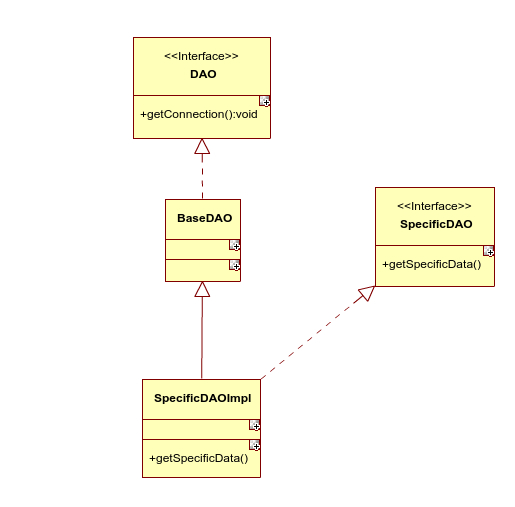


人们眼中的天才之所以卓越非凡，并非天资超人一等，而是付出了持续不断的努力。1万小时的锤炼是任何人从平凡变成世界级大师的必要条件。


<!-- more -->

### DAO

`DAO`,Data Acess Object。数据访问对象，顾名思义，是用来访问数据的，数据存在于数据库中，显然DAO用于访问数据库。

### 连接池

为什么要用连接池呢？数据库连接池正如同线程池的目的一样都是为了提高效率，对于数据库连接池，用户每次请求都需要创建一个数据库连接，这毫无疑问会使系统变得异常缓慢，为了避免这样的系统效率问题，所以有了连接池这种方式，系统启动时就会创建一个连接池，连接池中有一定量的数据库连接对象，当用户发起请求，系统会到连接池中取一个连接，当请求完成后会将连接放回到连接池中，这样就大大提高了系统的执行效率。在JAVA Web开发中使用数据源DataSource来获取连接。

### DAO设计规范

刚刚入门的时候，我对DAO的设计一无所知，我只是单纯的把一张表对应一个DAO对象，直接创建一个类，并未做任何抽象。看了《Java Web应用开发和案例教程》之后，确实对DAO层的设计有了一定的了解。

#### 抽象

- 肯定需要抽象，所有DAO在使用的时候都会先获取数据库连接，因此可以抽象一个接口出来。把他叫做`DAO`

- 把DAO层公共的地方抽取出来当做一个类，比如说获取连接。其他普通的DAO类都会扩展此类，即继承此类。它叫做`BaseDAO`

- 对于特定的DAO也需要进行接口设计，因为这样有利于管理和设计

- 特定的DAO会继承BaseDAO并实现其特定接口

#### 整体类图

